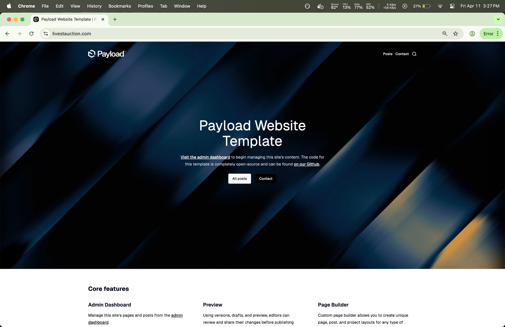
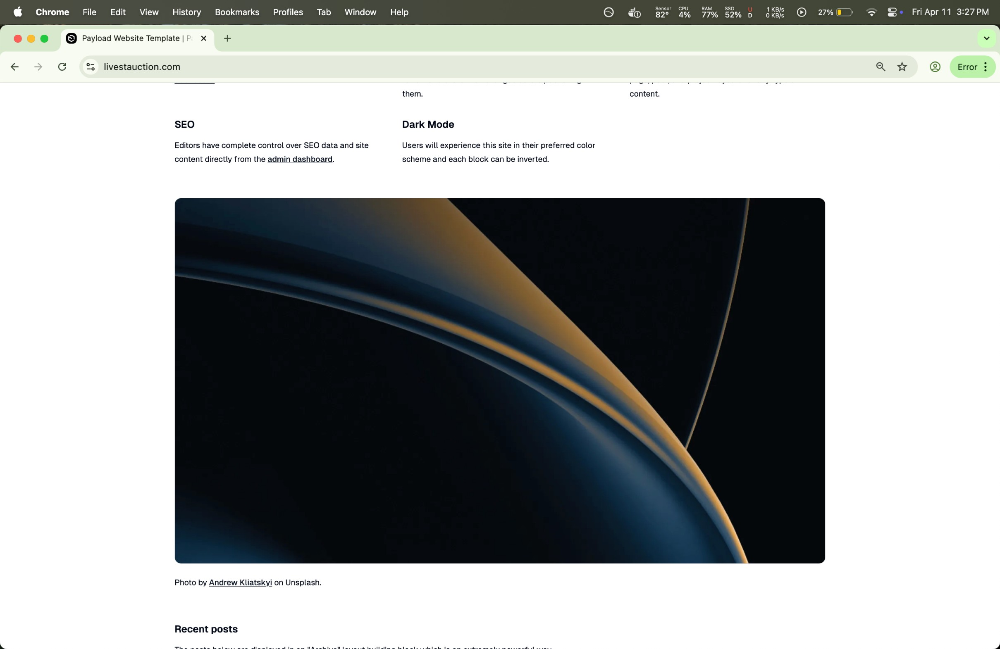
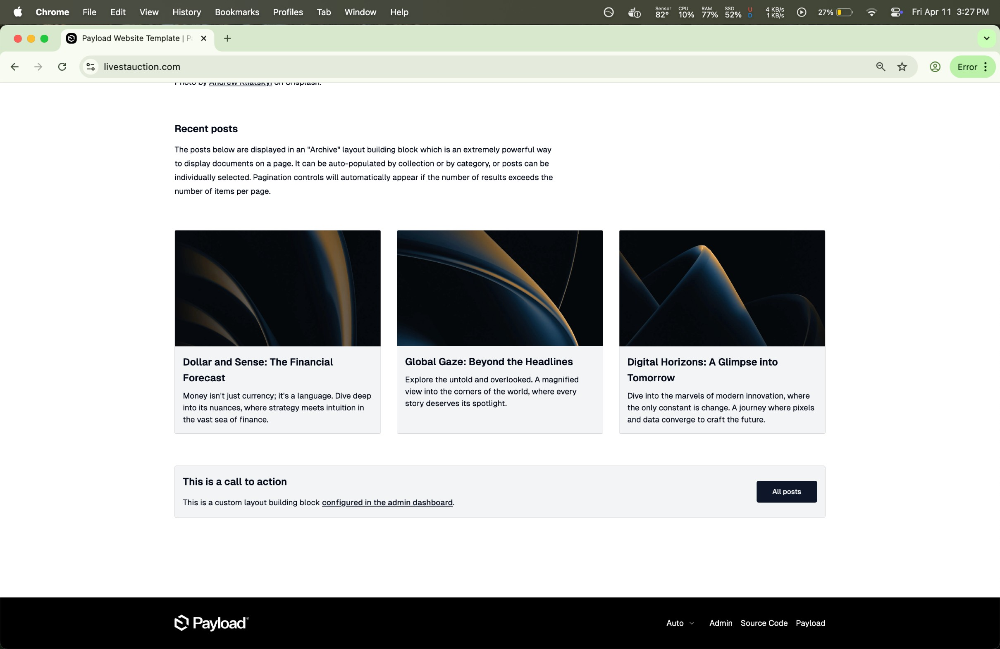

[](https://github.com/pmeaney/tmp-payloadcms-portfolio/actions/workflows/z-main.yml)

# Dockerized PayloadCMS + Postgres Portfolio Project Template

This project is a CICD Deployment Template of the Official PayloadCMS Website Template.

Its my framework for 1. A CICD Deployment of the project to my remote server, as well as 2. a local deployment environment setup (a script to pull remote data & media, then run the project locally) ready to edit and publish new changes.

Stack:
- Payload CMS (CMS + NextJS)
- Postgres

## Local dev

- Clone project
- Delete migration files if they exist-- I'll clear that up soon, might need to tinker a little more
- Run `docker compose -f docker-compose.dev.yml up`
  - This spins up a Postgres DB, then a PayloadCMS instance.
  - The PayloadCMS instance will run an entrypoint.sh file once its up and running, which, if no migration exists yet (they shouldn't on the first run-- so, just make sure ./payloadcms-cms-fe-portfolio2025/src/migrations is clear on the first deployment), will create the initial one.  Once the app is up and running, you'll be able to log into its admin dashboard on the browser at `localhost:3000/admin` and run a database seeding process which will create migration files & seed the website template with placeholder blog content.


## Remote / CICD things to be aware of:

- On push to the repo, the CICD workflow is activated-- it will deploy a Database (PostgreSQL) & a CMS (PayloadCMS) via Docker.  To make CICD Deployment work requires some setup of repo secrets & a github token token-- see [CICD-DOCS](./docs-and-extras/deployment-info/CICD-DOCS.md) & the CICD files (`.github/workflows`) for more info.
- the CICD Bot creates bind mount directories for the PayloadCMS project at /home/ghaCICDDevOpsUser -- for migrations files, and for media files

# Current state of the project:

Successfully deploying.  The initial migration & seeding work.
Therefore, I am going to leave this project in its current state.  

It's now a CICD Deployment Template plus a PayloadCMS Website Template.

The PayloadCMS Website Template

1. Ready to deploy
2. Ready to edit and push new changes to the server on every commit.
3. For deployment, currently, the migration process is extremely simple: The inital migration runs, at which point, you log into the browser admin, from there click the option to seed the database.  This seeds the project into a basic PayloadCMS / NextJS / PostgreSQL blog template.  
4. (From here, you'll either want to manually log in & commit those migration files (see below) or uncomment the CMS's CICD file (.github/workflows/b-cms-fe-check-deploy.yml), Lines 274-340 -- which upload the files from their bindmount location (the remote server's directory `/home/ghaCICDDevOpsUser/payloadcms-cms-fe-portfolio2025__migrations` to the github repo).  It's left in for reference.  More info below.  **After commenting those lines back in, the next commit will pick up the migration files & commit them to the repo**. I'll likely separate that out in the near future, as I begin working with PayloadCMS)


## Current state 

#### Build Log

The successful build log is available at: [successful-build-log.md](docs-and-extras/successful-build/successful-build-log.md)

#### Screenshots

Screenshots of the deployment of the Official [PayloadCMS Website Template](https://github.com/payloadcms/payload/tree/main/templates/website) via the dockerized CICD Deployment process I setup (.github/workflows)







## Docs

**Since starting this project, and through various docker deployments, data migrations, and a "production first, local sync" data synchronizing... I've gained a better understanding of the differences between the needs of remote production environments vs. local development environments.  So, I thought I would include a review of those practices and how this project approaches them:** 

- [Overview of Development and Production Workflows](./docs-and-extras/OVERVIEW-Dev-and-Prod-Workflows.md)
- [Production to Local data & content Synchronization](./docs-and-extras/OVERVIEW-Prod-To-Local-Sync.md)
  
# Troubleshooting deployment

**Things to clear out if experimenting with deployment or schema changes**

To clear out the project from the remote server, don't forget of these steps:

Since this project involves bind mounts, you can find those via this command:

```bash
humanDevOpsUser@server2025-debian:~$ docker inspect -f '{{json .Mounts}}' containerNameOrID

# Outputs: 
[{"Type":"bind","Source":"/home/ghaCICDDevOpsUser/payloadcms-cms-fe-portfolio2025__migrations","Destination":"/app/src/migrations","Mode":"","RW":true,"Propagation":"rprivate"}]

humanDevOpsUser@server2025-debian:~$ docker inspect -f '{{range .Mounts}}{{if eq .Type "bind"}}{{.Source}} -> {{.Destination}}{{println}}{{end}}{{end}}' containerNameOrID

# Outputs: 
/home/ghaCICDDevOpsUser/payloadcms-cms-fe-portfolio2025__migrations -> /app/src/migrations

```

We see the bind mount for the PayloadCMS is setup via the deployment (see its CICD File) is setup at this directory: /home/ghaCICDDevOpsUser/payloadcms-cms-fe-portfolio2025__migrations

Check out its parent directory... It probably shows two directories-- the CMS & DB both have a bind mount for their respective database related files.

For clearing out all data (e.g. for a fresh start, if you've run the migration before and the containers are already on the server) we'll want to remove both.

```bash
humanDevOpsUser@server2025-debian:~$ ls /home/ghaCICDDevOpsUser
payloadcms-cms-fe-portfolio2025__migrations  payloadcms-postgres-db-portfolio2025
```

So, delete both of those:
```bash
humanDevOpsUser@server2025-debian:~$ sudo rm -rf payloadcms-cms-fe-portfolio2025__migrations && \
humanDevOpsUser@server2025-debian:~$ sudo rm -rf payloadcms-postgres-db-portfolio2025
```

Next, delete the volumes used by the project

`docker volume ls`

```bash
humanDevOpsUser@server2025-debian:~$ docker volume ls
DRIVER    VOLUME NAME
local     payloadcms-postgres-data-prod
local     payloadcms-postgres-init-scripts-prod

# the CICD will re-create them if they don't exist, so don't worry about recreating them.
humanDevOpsUser@server2025-debian:~$ docker volume rm payloadcms-postgres-data-prod && docker volume rm payloadcms-postgres-init-scripts-prod

```

Now that you've deleted the bind mounts & volumes, you should be ok to delete the containers, and their data won't stick around.

You might also want to run a docker prune to delete and related docker assets (e.g. the project network-- which is recreated if it doesnt exist, in the CICD workflow)
`docker system prune -a --volume`.

So, not to worry-- the CICD workflow will create the assets it needs if they don't exist.  For a fresh deploy, delete all project assets and simply re-commit to the project repo to activate the CICD workflow.


# To Do

- [X] Setup CICD to deploy prod version to remote server
- [ ] Setup migration scheme
  - [ ] Production-first.  Will run initial migration on remote.  Then, will pull those files to local and commit them.  And periodically will download the data as well:
    - Setup a methodology (e.g. shell script) for Periodic Database Dumps and Restores, so local dev env has same data as remote prod env.

## Resources

- Original Repo, where I figured out a deployment methodology: 
  - [template-payloadcms-portfolio2025](https://github.com/pmeaney/template-payloadcms-portfolio2025)
- [PayloadCMS's Website Template](https://github.com/payloadcms/payload/tree/main/templates/website)

## CICD Workflow

```mermaid
flowchart TB
    GitPush[/"Push to main branch"/] --> MainWorkflow["z-main.yml
    Main Deployment Pipeline"]
    
    MainWorkflow --> DBCheckInit
    
    subgraph "Database Pipeline"
        DBCheckInit["a-db-init.yml
        Database Check & Init"]
        DBCheckInit --> CheckDBExists{"DB Container
        Exists?"}
        CheckDBExists -->|No| CreateDB["Create PostgreSQL Container
        - Create volumes
        - Configure networks
        - Set environment vars"]
        CheckDBExists -->|Yes| SkipDB["Skip Database Setup"]
    end
    
    CreateDB --> CMSFECheck
    SkipDB --> CMSFECheck
    
    subgraph "Frontend Pipeline"
        CMSFECheck["b-cms-fe-check-deploy.yml
        Frontend Check & Deploy"]
        CMSFECheck --> DownloadMarker["Download Last
        Deployment Marker"]
        DownloadMarker --> DetectChanges["Check PayloadCMS
        Directory Changes"]
        DetectChanges --> ChangesExist{"Changes
        Detected?"}
        
        ChangesExist -->|Yes| BuildPublish["Build & Publish
        Docker Image"]
        BuildPublish --> DeployFE["SSH to Server &
        Deploy Frontend
        (step-deploy--cms-fe)"]
        DeployFE --> SaveMarker["Save Deployment
        Marker Artifact"]
        
        ChangesExist -->|No| SkipFE["Skip Frontend
        Deployment"]
    end
    
    subgraph "Docker Build Process"
        BuildPublish --> DockerBuildStages["Multi-stage Dockerfile"]
        
        subgraph "Build Stages"
            subgraph "Base & Dependencies Setup"
                DockerBuildStages --> BaseImage["Base Stage
                - node:20-alpine
                - Install pnpm@10.3.0"]
                BaseImage --> DepsStage["Dependencies Stage
                - Add libc6-compat
                - Copy package.json & lock file
                - pnpm install --frozen-lockfile"]
                DepsStage --> BuilderStage["Builder Stage
                - Copy dependencies from Dependencies Stage
                - Copy all source files
                - Copy ENV_FILE to .env
                - Set SKIP_NEXTJS_BUILD flag"]
            end
            
            subgraph "Build Decision & Execution"
                BuilderStage --> SkipNextBuild{"SKIP_NEXTJS_BUILD
                = true?"}
                SkipNextBuild -->|Yes| PrepareRuntime["Prepare for Runtime Build
                - Create minimal .next
                - Set skip-build flag
                - Copy src, config files"]
                SkipNextBuild -->|No| RunBuild["Run Full Build
                - pnpm run ci
                - Build Next.js app"]
            end
            
            subgraph "Runtime Preparation"
                PrepareRuntime --> RuntimePrep["prepare-runtime Stage
                - Copy env vars, public files
                - Copy config files
                - Copy entrypoint.sh
                - Copy src/migrations"]
                RunBuild --> RuntimePrep
                
                RuntimePrep --> RuntimeBuildCheck{"SKIP_NEXTJS_BUILD
                = true?"}
                RuntimeBuildCheck -->|Yes| CopySourceFiles["Copy entire src dir
                for runtime build"]
                RuntimeBuildCheck -->|No| CopyBuildOutput["Copy built .next
                artifacts"]
                
                CopySourceFiles --> RunnerStage
                CopyBuildOutput --> RunnerStage
            end
            
            subgraph "Final Image"
                RunnerStage["Runner Stage
                - Set NODE_ENV=production
                - Install postgresql-client
                - Add nextjs user/group
                - Copy prepared files
                - Set file permissions
                - Expose port 3000"]
                RunnerStage --> FinalDockerImage[/"Docker Image
                ghcr.io/pmeaney/tmp-payloadcms-portfolio2025:latest"/]
            end
        end
    end
    
    subgraph "Deployment Process"
        DeployFE --> SSHToServer["SSH to Production Server"]
        SSHToServer --> AuthGHCR["Authenticate with
        Container Registry"]
        AuthGHCR --> CreateEnvFile["Create Prod Env File
        from PAYLOAD__SECRET_ENV_FILE"]
        CreateEnvFile --> PullImage["docker pull
        ghcr.io/pmeaney/tmp-payloadcms-portfolio2025:latest"]
        PullImage --> RemoveOldContainer["docker rm -f
        payloadcms-cms-fe-portfolio-prod"]
        RemoveOldContainer --> RunContainer["docker run
        - Set container name
        - Connect to postgres network
        - Connect to main network
        - Map port 3000
        - Inject env vars"]
        
        FinalDockerImage -.-> PullImage
    end
    
    subgraph "Container Runtime"
        RunContainer --> EntrypointScript["entrypoint.sh Execution"]
        
        EntrypointScript --> EnvCheck["Environment Checks
        - Verify DATABASE_URI
        - Verify PAYLOAD_SECRET"]
        EnvCheck --> ParseDBParams["Parse Database
        Connection Parameters
        from DATABASE_URI"]
        ParseDBParams --> WaitForDB["Wait for PostgreSQL
        (30 attempts with 3s delay)
        using pg_isready"]
        
        WaitForDB --> RunMigrations["Run Database Migrations
        pnpm run payload:migrate"]
        RunMigrations --> CheckSkipBuildFlag{".next/skip-build
        file exists?"}
        
        CheckSkipBuildFlag -->|Yes| BuildNextJS["Build Next.js
        NEXT_SKIP_DB_CONNECT=true
        pnpm run build"]
        CheckSkipBuildFlag -->|No| StartApp["Start Next.js Application
        pnpm run start"]
        BuildNextJS --> StartApp
    end
    
    subgraph "Verification & Summary"
        DeployFE --> WaitPeriod["Wait Period (4 min)"]
        WaitPeriod --> CheckContainers["docker ps -a"]
        CheckContainers --> CheckLogs["docker logs
        <containerId>"]
        
        SkipDB --> DeploySummary["Generate Deployment
        Summary"]
        CreateDB --> DeploySummary
        SkipFE --> DeploySummary
        SaveMarker --> DeploySummary
        DeploySummary --> MarkdownReport["Create Markdown Report
        - Commit details
        - Database status
        - Frontend changes
        - Action taken"]
    end
    
    classDef workflow fill:#f9f,stroke:#333,stroke-width:2px
    classDef process fill:#bbf,stroke:#333,stroke-width:1px
    classDef decision fill:#fbb,stroke:#333,stroke-width:1px
    classDef container fill:#bfb,stroke:#333,stroke-width:1px
    classDef dockerstage fill:#9de,stroke:#333,stroke-width:1px
    classDef entrypoint fill:#bfd,stroke:#333,stroke-width:1px
    
    class MainWorkflow,DBCheckInit,CMSFECheck workflow
    class DetectChanges,BuildPublish,DeployFE,RunContainer process
    class CheckDBExists,ChangesExist,CheckSkipBuildFlag,SkipNextBuild,RuntimeBuildCheck decision
    class StartApp container
    class BaseImage,DepsStage,BuilderStage,PrepareRuntime,RunBuild,RuntimePrep,RunnerStage,CopySourceFiles,CopyBuildOutput dockerstage
    class EntrypointScript,EnvCheck,ParseDBParams,WaitForDB,RunMigrations,BuildNextJS entrypoint
```




## Notes to self

Clearing out the old project

delete bind mounts & volumes, then cleanup

```
sudo rm -rf /home/ghaCICDDevOpsUser/payloadcms-cms-fe-portfolio2025__migrations/
sudo rm -rf /home/ghaCICDDevOpsUser/payloadcms-cms-fe-portfolio2025__media/
sudo rm -rf /home/ghaCICDDevOpsUser/payloadcms-postgres-db-portfolio2025/
docker volume rm payloadcms-postgres-data-prod && docker volume rm payloadcms-postgres-init-scripts-prod

# then remove the containers
# then prune: `docker system prune -a --volumes`
```

