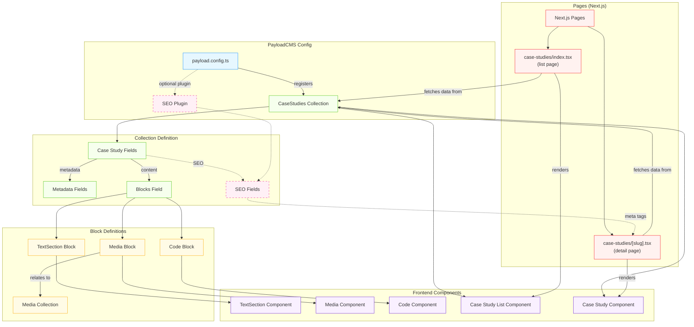

# PayloadCMS Component Dependency Chain Guide 


Summary of steps:


At length:

Let's say we want to create a new content category of "Case Studies". It's really quite similar to a blog, in terms of using Text, Media, Code components, etc. Case Studies are more formal than blogs. And, if we want to have both a Blog page and a Case Study page, we'll need to differentiate them as separate categories of content. So, using Case Studies as an example, here's a visualization of the dependency chain regarding how...

- A NextJS page ("Case Studies")... involves two types of pages:
  - A general list (an overall landing page containing a set of Case Studies)
  - A singular "case study" page for each particular case study

- Each of the Pages above depends on pulling data from a Collection-- that is, the Database of Case Study content, which will be auto-generated by PayloadCMS when we register with payload.config.ts the properly formatted Collection Config file 

- The Collection Config defines its fields of two main types:
  - Metadata Fields: These are the core fields that define a case study (title, author, date, slug, etc.)
  - Blocks Field: This provides the flexible content structure where editors can add different content blocks-- such as paragraphs, images, links, other content, within the vertical space of the case study page etc.

- Those content blocks relate to the Block Definition files (at `./src/blocks`)-- which you can sort of think of as ReactJS Parent Components... which incorporate Child Components-- which are at `./src/components`-- shown as "Frontend Components" in the diagram below. They're essentially the lower level components-- the UI components which are imported into the Blocks (for Admin views) & Pages (for Public Views)



## Adding in SEO Settings for Case Studies

PayloadCMS provides excellent support for SEO through its official plugin. Here's how to set up SEO capabilities for your Case Studies collection:

### 1. Install the SEO Plugin

First, install the SEO plugin if it's not already part of your website template:

```bash
npm install @payloadcms/plugin-seo
# or
yarn add @payloadcms/plugin-seo
```

### 2. Configure the SEO Plugin

In your `payload.config.ts` file, import and configure the SEO plugin:

```typescript
import { buildConfig } from 'payload/config';
import seo from '@payloadcms/plugin-seo';
import { CaseStudies } from './collections/CaseStudies';

export default buildConfig({
  collections: [
    CaseStudies,
    // Other collections...
  ],
  plugins: [
    seo({
      collections: ['case-studies'],
      // Generate sensible defaults based on case study content
      generateTitle: ({ doc }) => `${doc.title} | Your Company Case Studies`,
      generateDescription: ({ doc }) => doc.summary || '',
      generateURL: ({ doc }) => `https://yourwebsite.com/case-studies/${doc.slug}`,
      generateImage: ({ doc }) => doc.featuredImage?.url || '',
    }),
    // Other plugins...
  ],
});
```

### 3. Add SEO Fields to Case Studies Collection

The SEO plugin automatically injects SEO fields into your Case Studies collection. However, you might want to customize how they appear:

```typescript
// src/collections/CaseStudies.ts
import { CollectionConfig } from 'payload/types';

export const CaseStudies: CollectionConfig = {
  slug: 'case-studies',
  admin: {
    useAsTitle: 'title',
    group: 'Content', // Group in the admin sidebar
  },
  fields: [
    // Metadata fields
    {
      name: 'title',
      type: 'text',
      required: true,
    },
    {
      name: 'summary',
      type: 'textarea',
      admin: {
        description: 'Brief summary of the case study (also used for SEO description)',
      },
    },
    {
      name: 'featuredImage',
      type: 'upload',
      relationTo: 'media',
      admin: {
        description: 'Featured image (also used for SEO)',
      },
    },
    // More metadata fields...
    
    // Content blocks field
    {
      name: 'content',
      type: 'blocks',
      blocks: [
        // Your block references here
      ],
    },
    
    // Note: SEO fields are automatically added by the plugin
    // You don't need to manually add them
    
    // Optional: Custom tab arrangement to organize fields
    {
      type: 'tabs',
      tabs: [
        {
          label: 'Content',
          fields: ['title', 'summary', 'featuredImage', 'content'],
        },
        {
          label: 'SEO', // This tab will contain the SEO fields
          fields: ['meta'], // 'meta' is automatically added by the plugin
        },
      ],
    },
  ],
};
```

### 4. Implement SEO in the Frontend

Finally, implement the SEO meta tags in your Next.js pages:

```tsx
// src/app/case-studies/[slug]/page.tsx
import { Metadata } from 'next';
import { getPayloadClient } from '@/payload';
import { notFound } from 'next/navigation';
import CaseStudyComponent from '@/components/CaseStudy';

// Generate metadata for SEO
export async function generateMetadata({ params }): Promise<Metadata> {
  const payload = await getPayloadClient();
  
  const caseStudies = await payload.find({
    collection: 'case-studies',
    where: {
      slug: {
        equals: params.slug,
      },
    },
  });
  
  const caseStudy = caseStudies.docs[0];
  
  if (!caseStudy) {
    return {};
  }
  
  // Access the SEO data from the meta field
  const { meta } = caseStudy;
  
  return {
    title: meta?.title || caseStudy.title,
    description: meta?.description || caseStudy.summary,
    openGraph: {
      title: meta?.title || caseStudy.title,
      description: meta?.description || caseStudy.summary,
      images: meta?.image?.url ? [{ url: meta.image.url }] : [],
    },
    // More SEO metadata as needed
  };
}

// Page component
export default async function CaseStudyPage({ params }) {
  const payload = await getPayloadClient();
  
  const caseStudies = await payload.find({
    collection: 'case-studies',
    where: {
      slug: {
        equals: params.slug,
      },
    },
  });
  
  const caseStudy = caseStudies.docs[0];
  
  if (!caseStudy) {
    return notFound();
  }
  
  return <CaseStudyComponent caseStudy={caseStudy} />;
}
```

### Benefits of This Approach

1. **Automatic SEO Fields**: The plugin automatically adds all the necessary SEO fields.

2. **Default Generators**: The plugin can generate sensible defaults based on case study content.

3. **Custom Control**: Editors can override the automatic SEO settings when needed.

4. **Tab Organization**: Keeps the SEO settings neatly organized in their own tab.

5. **Frontend Integration**: Easily access and use SEO data in your Next.js pages.

This approach gives you the best of both worlds—automated SEO generation based on content, with the option for manual fine-tuning when necessary. The SEO plugin handles all the complex parts, leaving you to focus on creating great case studies.