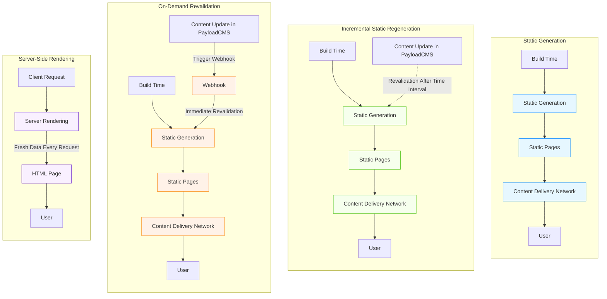
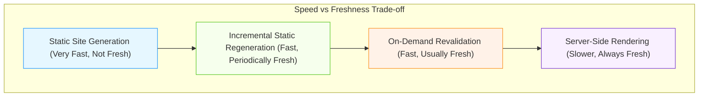
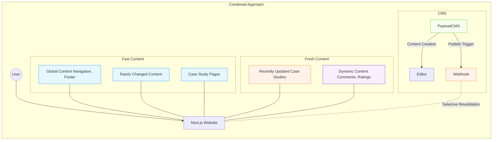

# Next.js Data Loading Strategies with PayloadCMS

This document explains how to balance fast loading with fresh content when using Next.js with PayloadCMS for a case studies section, outlining the various approaches and their best use cases.

## Four Main Approaches to Content Loading

### 1. Static Generation (SSG)
**What:** Your entire site is built once and doesn't change until you rebuild it.  
**Like:** Printing a book - fast to read but can't update it.  
**Best for:** Content that rarely changes (About page, documentation).

### 2. Incremental Static Regeneration (ISR)
**What:** Pages are built statically but refreshed on a schedule.  
**Like:** A newspaper subscription - delivered every morning with fresh news.  
**Best for:** Content that changes predictably but not urgently (weekly blog posts).

### 3. On-Demand Revalidation
**What:** Pages are static but instantly refreshed when content changes.  
**Like:** Having a personal assistant who immediately brings you updated information.  
**Best for:** Important content that needs to be fresh when updated (case studies, product pages).

### 4. Server-Side Rendering (SSR)
**What:** Pages are built fresh for each visitor.  
**Like:** A chef cooking a meal to order - fresh but takes time.  
**Best for:** Highly personalized or frequently changing content (dashboards, real-time data).

## The Trade-off: Speed vs. Freshness

There's always a trade-off between:
- **Speed:** How quickly pages load for users
- **Freshness:** How up-to-date the content is

As you move from Static Generation toward Server-Side Rendering, content becomes fresher but typically loads more slowly.

## The "Maybe Too Complicated"  Smart Approach: Combine Methods-- An example of what is possible

### (One of the initial 4 patterns is enough for most basic use cases)

The ideal strategy for case studies is to use a combined approach:

1. **Pre-build the framework:** Have your site's shell, navigation, and common elements pre-built statically
2. **Pre-generate important case studies:** Your most popular case studies are pre-built
3. **Use on-demand revalidation:** When you publish a new case study or update an existing one, only that page gets rebuilt

### Why This Works Well

- **Users get fast pages:** Most content is pre-built and instantly available
- **Editors see changes quickly:** When you publish in PayloadCMS, the changes appear on the site almost immediately
- **Server resources are optimized:** You're not rebuilding everything all the time

## Practical Implementation for Case Studies

1. **At Build Time:**
   - Pre-build your case studies listing page
   - Pre-build your most important case studies

2. **When Content Changes:**
   - PayloadCMS sends a notification to your Next.js site
   - Only the affected pages are rebuilt
   - CDN caches are updated with the new content

3. **For Visitors:**
   - They always get the fastest possible experience
   - They see your latest content shortly after you publish it

This approach gives you the best of both worlds - the speed of static generation with the freshness of dynamic content, perfect for a case studies section that needs to be both fast and current.

## Technical Implementation Notes

To implement on-demand revalidation:

1. Set up static generation for your case studies pages
2. Create a webhook endpoint in your Next.js app
3. Configure PayloadCMS to call this webhook when content changes
4. Use Next.js revalidation API to refresh only the affected pages

This strategy is particularly effective for case studies which have a high read-to-write ratio (many people viewing, relatively few updates).